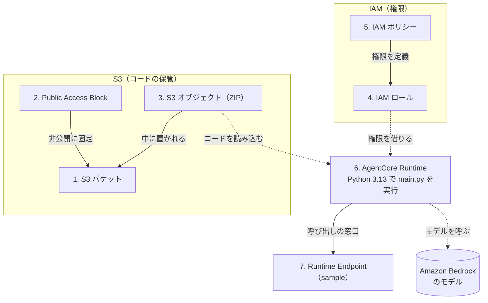

# AgentCore Runtime sample が作る AWS リソース

Terraform サンプル [`agentcore-runtime-basic`](../../../terraform/aws/agentcore-runtime-basic/README.md) を
apply すると、AWS 上に **7つのリソース**が作られます。このドキュメントは、Terraform を
まだ触ったことがない人向けに「**何が・なぜ作られ・どう繋がるか**」を解説します。
個々のコマンド手順は sample の README に任せ、ここでは全体像の理解に集中します。

> [WARNING] AgentCore Runtime と Amazon Bedrock のモデル呼び出しは利用量に応じて
> 課金されます。学習が終わったら必ず削除してください（[6. コストと削除](#6-コストと削除)）。
> 料金やサービス仕様は変わることがあります。最新情報は AWS 公式で確認してください
> （このドキュメントは2026年6月時点の説明です）。

## 1. このサンプルは何をするものか

[Amazon Bedrock AgentCore Runtime](https://docs.aws.amazon.com/bedrock-agentcore/latest/devguide/runtime.html) は、
**サーバーを自分で用意せずに AI エージェントを動かせる、サーバーレスな実行環境**です。
このサンプルでは、Python で書かれた小さなエージェント（[`agentcore-strands-basic`](../../../apps/agentcore-strands-basic/README.md)）を
AgentCore Runtime にデプロイし、呼び出せる状態にするまでを Terraform で組み立てます。

コードの渡し方には **direct code deployment**（コードを直接デプロイする方式）を使います。
これは、コンテナイメージを自分でビルドする代わりに、**コード一式を ZIP に固めて渡すだけ**で
動かせる手軽な方式です。その ZIP の保管場所（S3）と、実行に必要な権限（IAM）も合わせて
作るため、リソースが7つに分かれています。

## 2. 全体像

7つのリソースは、大きく「**コードの保管（S3）**」「**権限（IAM）**」「**実行本体（AgentCore）**」の
3グループに分かれ、次のように繋がります。

実線は「Terraform が作るときの依存関係」、点線は「エージェントが動くときの流れ」です。

## 3. 7つのリソース早見表

| # | リソース（Terraform の種類） | 役割（ひとことで） |
| --- | --- | --- |
| 1 | S3 バケット（`aws_s3_bucket`） | エージェントのコード（ZIP）を入れる箱 |
| 2 | Public Access Block（`aws_s3_bucket_public_access_block`） | その箱を「外から見えない」状態に固定 |
| 3 | S3 オブジェクト（`aws_s3_object`） | デプロイするコード本体（ZIP） |
| 4 | IAM ロール（`aws_iam_role`） | Runtime が一時的に「借りる」権限の入れ物 |
| 5 | IAM ポリシー（`aws_iam_role_policy`） | 借りられる権限の中身（何をしてよいか） |
| 6 | AgentCore Runtime（`aws_bedrockagentcore_agent_runtime`） | エージェントを実行する本体 |
| 7 | Runtime Endpoint（`aws_bedrockagentcore_agent_runtime_endpoint`） | 外から呼び出すための窓口 |

> [INFO] リソース名（例: `agentcore-basic-...`）は変数 `name_prefix` から組み立てられます。
> 以下の名前はデフォルト設定での**例**で、設定を変えると変わります。

## 4. リソースの役割（くわしく）

### 1. S3 バケット — コードの保管庫

- **何**: ファイルを保管する AWS のストレージ（バケット = 入れ物）。例: `agentcore-basic-<アカウントID>-<リージョン>`。
- **なぜ**: AgentCore Runtime は、デプロイするコードを **S3 から読み込む**仕組みです。そのための置き場所が要ります。
- **役割**: 次の ZIP（リソース3）を保管します。

### 2. Public Access Block — 非公開の固定

- **何**: バケットへの「インターネットからのアクセス」をまとめてブロックする設定。
- **なぜ**: コードは社外に公開すべきものではありません。うっかり公開設定にしてしまう事故を防ぎます。
- **役割**: バケットを**非公開**に固定します（公開設定の4項目をすべて禁止）。

### 3. S3 オブジェクト（ZIP）— コード本体

- **何**: バケットの中に置かれる1つのファイル。中身はエージェントのコード一式を固めた ZIP。例のキー: `agentcore-runtime/<ハッシュ>.zip`。
- **なぜ**: これが実際に AgentCore Runtime で動く**プログラム本体**です。`apply` の前に `package.sh` で作っておきます。
- **役割**: Runtime が起動時に読み込むコードを提供します。

### 4. IAM ロール — 権限を借りる入れ物

- **何**: AWS の「権限の役割」。例: `agentcore-basic-runtime-role`。
- **なぜ**: AgentCore Runtime は、S3 のコードを読んだり Bedrock を呼んだりする必要があります。その権限を**ロールという形で一時的に借りて**動きます。
- **役割**: 「AgentCore Runtime だけがこのロールを借りられる」と決め（信頼関係）、借り手に権限を渡す入れ物になります。

### 5. IAM ポリシー — 権限の中身

- **何**: ロールに結び付く「何をしてよいか」のルール。例: `agentcore-basic-runtime-policy`。
- **なぜ**: ロールは「入れ物」なので、中身（許可する操作）を別に定義します。
- **役割**: このサンプルでは次の3種類を許可します。
  - S3 から**コード（ZIP）を読み取る**
  - 実行ログを **CloudWatch Logs に書き込む**
  - **Bedrock のモデルを呼び出す**（エージェントが AI モデルと会話するため）

### 6. AgentCore Runtime — 実行本体

- **何**: エージェントを実行するマネージドな環境。例の名前: `agentcore_basic`。
- **なぜ**: サーバーを自分で立てずにエージェントを動かすための、このサンプルの**主役**です。
- **役割**: S3 の ZIP からコードを読み込み、**Python 3.13 で `main.py` を起動**します。リソース4のロールを借りて権限を得て、必要なら Bedrock のモデルを呼びます。

### 7. Runtime Endpoint — 呼び出しの窓口

- **何**: Runtime を外から呼び出すためのアドレス（窓口）。このサンプルでは `sample` という名前で1つ作ります。
- **なぜ**: Runtime 本体だけでは呼び出し口が定まりません。窓口を用意して初めて invoke（実行依頼）できます。
- **役割**: `sample` エンドポイント経由でエージェントを呼び出せるようにします。
- **学習ポイント**: AgentCore は Runtime 作成時に `DEFAULT` という窓口も**自動で**作ります。このサンプルでは、それとは別に Terraform で管理する `sample` 窓口を**あえて1つ追加**し、窓口の作成・削除も学べるようにしています。

## 5. これらを Terraform がまとめて作る

7つのリソースは1つずつ手で作るのではなく、**Terraform が依存関係の順に自動で作成**します。
基本の3コマンドだけ覚えれば十分です。

- `plan`: これから**何が作られる／変わるか**を、実際に変更する前に一覧で確認する。
- `apply`: `plan` の内容を実行して、リソースを**実際に作成**する。
- `destroy`: 作ったリソースを**まとめて削除**する。

依存関係（例: ロールができてから Runtime を作る）は Terraform が自動で解決するので、
順番を気にする必要はありません。実際のコマンドは
[sample の README](../../../terraform/aws/agentcore-runtime-basic/README.md) を参照してください。

## 6. コストと削除

このサンプルは **mutating（リソースを実際に作る）** な学習用です。AgentCore Runtime と
Bedrock のモデル呼び出しは利用量に応じて課金される可能性があります。

- **削除手順**: [`agentcore-runtime-basic/cleanup.md`](../../../terraform/aws/agentcore-runtime-basic/cleanup.md) に従って `destroy` してください。
- **料金の確認**: [AWS 課金・コストの確認](../aws-billing/README.md) で利用額を確認できます。

学習が終わったら早めに削除し、想定外の課金を防ぎましょう。
