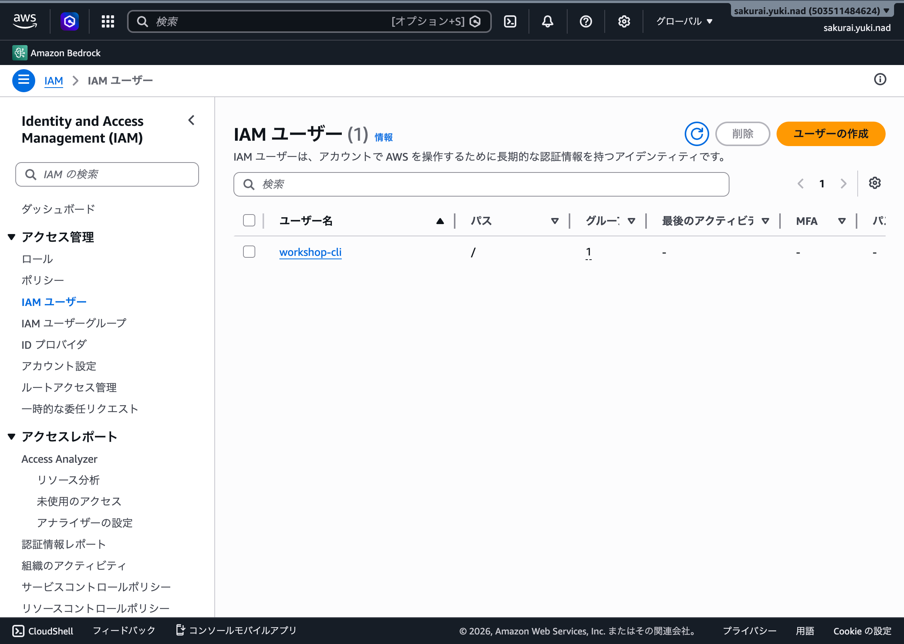
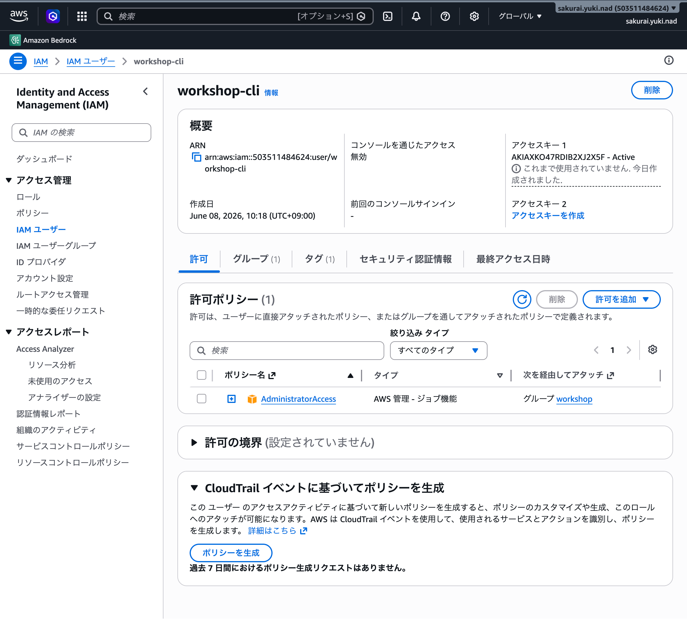
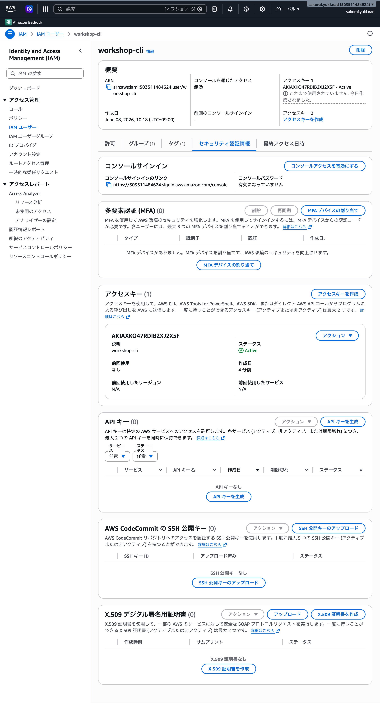

# IAM ユーザー作成とアクセスキー取得手順

AWS CLI をアクセスキー方式（[AWS CLI 基本コマンド](../aws-cli/README.md) の「前提 B」）で利用するための、IAM ユーザー作成からアクセスキー発行までの手順書です。

> [WARNING] アクセスキーは長期認証情報です。可能なら IAM Identity Center (SSO) によるログイン（前提 A）を優先してください。本手順はアクセスキーが必要な場合のみ利用します。
> 発行したシークレットアクセスキーは再表示できません。`.local` ファイルや環境変数で安全に管理し、repository には絶対に commit しないでください。

## 前提

- AWS Management Console に IAM ユーザー/ロールを作成できる権限でサインインしていること
- 作成するユーザーに付与する権限ポリシー（本例では管理者グループ `workshop` 経由で `AdministratorAccess`）を決めていること

## 手順

### 1. IAM ユーザー一覧を開き「ユーザーの作成」

IAM コンソールの **アクセス管理 > IAM ユーザー** を開き、右上の **ユーザーの作成** からユーザーを作成します。本例では `workshop-cli` という名前で作成しています。



### 2. 作成したユーザーの概要と許可ポリシーを確認

作成したユーザー名をクリックして詳細を開き、**概要**（ARN・作成日）と **許可ポリシー** を確認します。本例では `AdministratorAccess`（AWS 管理ポリシー）をグループ `workshop` 経由でアタッチしています。



### 3. セキュリティ認証情報タブでアクセスキーを作成

**セキュリティ認証情報** タブを開き、**アクセスキー** セクションの **アクセスキーを作成** からアクセスキーを発行します。

- ユースケースとして「コマンドラインインターフェイス (CLI)」を選択します。
- 発行直後に表示される **アクセスキー ID** と **シークレットアクセスキー** を控えます（シークレットは一度しか表示されません）。



## 取得後: CLI への設定

発行したアクセスキーは [AWS CLI 認証情報の設定](../aws-cli-credentials/README.md) の手順で CLI に設定します。

```bash
mise exec -- aws configure --profile work   # 対話設定（~/.aws/credentials に保存）
mise exec -- aws sts get-caller-identity     # 認証が通るか疎通確認
```

## 後始末（推奨）

- 使わなくなったアクセスキーは IAM の **セキュリティ認証情報** から **無効化 / 削除** してください。
- アクセスキーは定期的にローテーション（再発行）し、不要な長期認証情報を残さないようにします。
